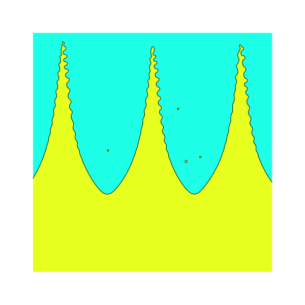

# Input fields
This includes a series of routines to read existing results and use them as
initial conditions for a new simulation.

* [input_matrix()](auxiliar_input.h) - This format reads a binary file written
    using [output_matrix()](http://basilisk.fr/src/output.h) and loads it into a
    field selected by the user. For instance, to read a square field of size
    **L0** defined inside a regular Cartesian grid with **N** points, starting
    from (**X0**,**Y0**) stored in a file "example.bin" and load it into a
    scalar field,

    ```c
        scalar T[];
        ...
        fprintf (stderr, "Reprising run from existing initial conditions ... \n");
        fprintf (stderr, "Read from example.bin ... \n");

        FILE * fp = fopen("example.bin", "r");
        if (!fp) printf("Binary file not found");
        input_matrix(T,fp,N,X0,Y0,L0);
        fclose (fp);
        ...
        boundary(T);
    ```

    An example on how to generate some arbitrary initial condition using matlab
    is available [here](test_input_matrix.c)

* [initial_condition_2Dto3D()](initial_conditions_2Dto3D.h) - This function
    reads 2D simulation results from a binary file in a format compatible with
    the gnuplot binary matrix format in double precision, see
    [auxiliar_input.h](auxiliar_input.h). The 2D results are then used to
    initialize a 3D simulation, which may be useful to reduce computational cost
    by avoiding long transients, or to focus on the development of 3D
    instabilities from a 2D base state.

    
    

    *An example of the intial condition in 2D (left) and the corresponding 3D interface (right).*

* [initial_conditions_dimonte_fft2()](input_fields/initial_conditions_dimonte_fft2.h)
    This can be used to initialize an interface using an annular spectrum as in
    [Dimonte et al. (2004)](#dimonte2004).

    
    

    *An example of the initialized interface using `isvof=0` (left) and `isvof=1` (right).*

# References

```bib
@article{dimonte2004,
  author = {Dimonte, Guy and Youngs, D. L. and Dimits, A. and Weber, S. and Marinak, M. and Wunsch, S. and Garasi, C. and Robinson, A. and Andrews, M. J. and Ramaprabhu, P. and Calder, A. C. and Fryxell, B. and Biello, J. and Dursi, L. and MacNeice, P. and Olson, K. and Ricker, P. and Rosner, R. and Timmes, F. and Tufo, H. and Young, Y.-N. and Zingale, M.},
  title = {A comparative study of the turbulent Rayleigh–Taylor instability using high-resolution three-dimensional numerical simulations: The Alpha-Group collaboration},
  journal = {Physics of Fluids},
  volume = {16},
  number = {5},
  pages = {1668-1693},
  year = {2004},
  month = {05},
  issn = {1070-6631},
  doi = {10.1063/1.1688328},
}